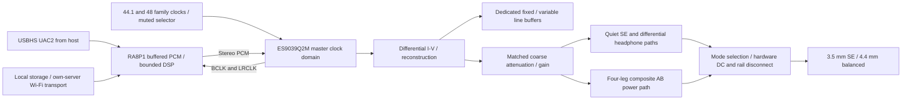

# Stage 6: recommended portable and desktop audio architecture

**2026-10-05 external-review update:** the transport and high-power amplifier recommendation is
reopened by [the disposition record](audio_external_review_2026-10-05.md).
RA8P1 remains system master. The sixteen-BUF634A bank is a research
comparator; no high-power implementation is selected. PCM768/DSD512, premium Bluetooth and the higher desktop envelope are
now owner-required. XU316 is the primary high-rate bridge candidate;
its exact package and routing are not selected.
Earlier recommendations below remain traceable study history, not a design
freeze. Use the revised work plan for the next implementation steps.

2026-10-05. **Provisional architecture selection for component investigation**,
not a performance rating, procurement release or finished circuit.
The owner requested staged research before final audio CAD. Stages 1–5 now
have source-linked studies and checked arithmetic. Independent review found
no remaining calculation blocker; corrections to Cirrus operating modes and
main-host PD routing were incorporated. Bench tests, sourcing confirmations,
stability/thermal and several interface proofs remain open.

## Primary recommendation

Recommend **one ES9039Q2M differential DAC, separate quiet IEM/ordinary and
high-power headphone paths, a precision composite AB desktop amplifier,
native RA8P1 USBHS/DSP and negotiated host-powered USB-C power management**.
Use dedicated line buffers branching ahead of the headphone stages.

Start component investigation with the manufacturer's differential I/V
reference, a precision switched-resistor coarse attenuator plus DAC fine
volume, and **OPA1656-controlled BUF634A buffer banks** for the high-power
path. The Stage 7 comparison now investigates four **independently controlled
unity composite branches** per leg, with required signal gain upstream.
The common-controller bank is rejected as the wiring basis. Four legs form
the balanced stereo output; the quiet path starts with OPA1622
on independent lower rails and low noise gain. Final resistor values,
compensation, rail generation and buffer count remain calculation/bench gates.
No unchanged earlier INA1620 power circuit is approved by this selection.

Keep the present RA8P1, external SDRAM/NOR/microSD and C6 Wi-Fi hardware
direction. Use the native USBHS foundation instead of adding XMOS/Linux by
default. **The present 5 MHz radio transport is insufficient for worst-case
192 kHz own-server streaming**. Faster SPI timing or an alternate transport
is an integration hold point; neither has been approved. Wireless headphone
audio is not established by C6. No firmware implementation is part of this task.

One main USB-C port carries host audio and host power. Negotiate offered PD;
host budget supplies playback first and charges from surplus. When full,
charging stops and desktop playback must not repeatedly cycle the pack.
High rails require a valid sufficient contract, rail health and thermal
permission. The retained protected Jauch 1S pack remains the first battery
candidate, with a protected 2S alternative if current/efficiency/runtime
qualification justifies reopening the existing low-voltage supervision.
TPS25751D/BQ25798 is the **first PD/charger pair to qualify**, not a safe
drop-in circuit. Wet/default/NTC configuration and battery isolation are open.

### Why this wins the initial comparison

This conversion path has genuine differential outputs, modest DAC core
power and public current reference information. The candidate's small-quantity
price is about $19. It does not require the two-chip AKM modulator/DAC pair,
four-channel Cirrus inversion scheme or precision ladder bridge/references.
Its manufacturer -120 dB result was at a 10 Vrms evaluation output, so we
do not promise that number at our jacks. The reason to choose it is the
complete energy/interface/reference trade, not a presumed ESS sound.

Separate output paths are justified by **idle energy and noise gain**:
the high-current stage can be off during IEM/ordinary listening. A shared
power amplifier would need verified low-bias/low-noise operating modes and
additional buffer isolation to offer equivalent portable performance.
The primary integrated composite is reproducible from manufacturer examples
and avoids immediately inventing a discrete bias/SOA system. Its scalability
comes with real component count, bias power and thermal costs, accounted below.

## Runner-up and substitution triggers

The complete runner-up is **AK4497S differential voltage conversion with
the same quiet/high-power output separation, host platform and power roles**.
It removes four I/V cells and may simplify common-mode/filter qualification.
Its approximately 336–373 mW DAC consumption and ~$41 converter cost must
be weighed against the support stages it removes. Choose it if prototype
measurements show lower complete-chain energy or easier full-band/noise
qualification than the ESS I/V path, or ESS sourcing/document access fails.
DAC family substitution requires a new clock/rail/filter design, not a pin swap.

The preferred amplifier fallback is a precision **discrete AB composite**
with qualified bias tracking and hot SOA. Choose it if the buffer bank cannot
meet current sharing, compensation, heat or output-impedance goals at reasonable
area/power. Do not select output transistors until those comparisons establish
a benefit. A discrete label alone does not improve sound or current safety.

Cirrus remains a portable-energy contingency if full balanced conversion can
be obtained at lower whole-chain power; its boosted output/distortion conditions
and duplicated inversion/interface must be correctly budgeted. AK4499EX/AK4191
is a converter-margin option if extra power/area is affordable and measurements
justify it. The R-2R reference has documented high-frequency limitations and
extra bridge/reference/calibration work; no demonstrated system benefit here
justifies making it the primary or runner-up.

## Comparison and selected signal routing

| Architecture | Whole-system attraction | Main penalty | Disposition |
| --- | --- | --- | --- |
| ESS differential I/V + quiet path + composite bank | Low core energy, one differential converter, public references, scalable separate amplifier | I/V noise/stability; bank bias/sharing and board heat | Primary architecture for component investigation. |
| AK4497S voltage path + same amplifier branches | Fewer conversion amplifiers, true differential path | Higher DAC energy; whole-chain advantage unmeasured | Runner-up. |
| Dual/inverted CS43198 + same amplifier branches | Small core energy, no current I/V | Two chips/inversion timing, mode-dependent distortion, reference sensing | Portable-energy contingency. |
| AK4191 + AK4499EX + I/V | More converter margin and separated digital/analog devices | Reference/I/V energy, cost and area | Only if complete-device benefit is demonstrated. |
| DAC11001B ladder + bridge/interpolation | Documented precision ladder/reference experiment | Full-band dynamic performance, transport, reference/area/calibration burden | Not justified as the default personal player. |

Each signal branch has a loading/noise contract. Dedicated SE derives from
a precision differential receiver and quiet power stage. If high-power SE
is offered by two bank legs, each active output is ground referenced and
independently protected; never ground an active balanced negative terminal.
SE high-power voltage is half BTL at the same leg swing and has its own
current/thermal rating. Do not connect both output banks at once or assume
both jacks can play simultaneously.

Line target remains 2 Vrms SE / 4 Vrms differential into >=10 kohms, with
<=100 ohm source impedance and verified capacitive loading. Line mode
branches before the power bank. Fixed-line mode must not expose an inserted
IEM to uncontrolled full scale. Connector sensing and mode selection need
a hardware default-safe state and a defined user-visible mode contract.
Dedicated line connector versus shared-jack interlock is a mechanical/circuit
decision to close before final routing; no nonexistent line jack is implied.

## Output modes and energy consequences

All figures below are investigation limits. Actual hot device swing,
component tolerances, protection, continuous power and enclosure heat can
only lower them until verified. Keep IEM/low/medium/high signal gain distinct
from portable/desktop supply mode. Analog attenuation reduces upstream noise;
digital volume alone does not reduce noise generated after the DAC.

| Mode | Intended path/rails | Preliminary envelope / reason |
| --- | --- | --- |
| Quiet IEM and ordinary listening | OPA1622 quiet stages, investigate +/-3V signal/output rails, power bank off | Initial <=50mA peak/ch and <=0.5V SE / <=1V balanced ceiling, constrained by load; qualification must include 8–9 ohms. Very low gain/coarse attenuation and <=1uV unweighted noise are leading goals. Higher quiet-path gain/voltage only after hot linear-drive/noise proof. |
| Portable demanding headphones | Composite bank, investigate +/-6V and optional higher portable rails | Initial 4Vrms balanced, 0.25Apeak and 0.5W/ch caps for low rail mode. +/-5V is rejected for the unity-controller common-mode limit. Higher battery mode may investigate 8V ceiling with 1W/ch cap and separate pack/thermal proof. Runtime is shorter; no desktop rating implied. |
| Desktop low/mid impedance | Bank on, investigate +/-10V low-load/floor and +/-12V mid-load stretch | 2W/32 floor, 4W stretch with explicit current/power/SOA and source-budget limits. Buffer headroom can require the middle rail range for 4 W/32; do not assume +/-10V is sufficient. |
| Desktop high voltage | Bank on, investigate +/-14V | Up to 16 Vrms BTL, subject to 0.707Apeak and 4 W/ch caps. Intermediate-amplitude worst heat must be tested. |
| Line / preamp | Dedicated signal buffers, power headphone bank off | Fixed/variable 2 V SE or 4 V differential into line loads, independently muted and protected. |

Four nominal buffers share 0.707Apeak as 177mA each. The earlier hypothetical
25% sharing allowance is **not justified** by the datasheet. The
[offset/ballast investigation](audio_buffer_qualification.md) identifies why
typical DC output resistance cannot establish a guaranteed hot sharing bound;
shared feedback does not independently correct branch offsets. The next
prototype candidate uses one unity composite loop per buffer, sensing before
its own ballast; signal gain is upstream. Separate gain-2 loops with the
illustrative matched array exceed the typical-current comparison in aged
corners. See the complete [separate-loop comparison](audio_buffer_qualification.md#separate-loop-comparison-and-next-circuit-direction).
Native bank wiring stays on HOLD pending hot drive, stability and hardware
fault-disconnect review. The conditional unity screen is about 200mA at the
full low-load envelope; typical 250mA is not a guaranteed hot rating.
The exposed pad is at V-, so thermal copper must not be casually
tied to the ground plane. Preserve feedback before the disconnect; contact
opening must not leave the precision loop open or drive it into saturation.

The separate-loop direction allocates sixteen wide-bandwidth BUF634A,
sixteen loop cores and four provisional upstream OPA1656 gain cores. They
consume **5.992W typical idle at +/-14V**, **5.136W at +/-12V**, **4.280W
at +/-10V**, or **2.568W at +/-6V**, using 8.5mA/buffer and 3.9mA/core.
The earlier +/-5V allocation was 2.140W and cannot support the retained
4Vrms target with these unity loops. See the
[common-mode and portable energy correction](audio_composite_rails.md).
Upstream gain/count remain open. The earlier 4.245W high-rail number used
only four controllers and no longer represents this candidate.
Low-bias buffer operation reduces energy but
changes loop behavior; no such loop is qualified. High-power portable
runtime cannot use the 10-hour quiet-playback number. Six quiet OPA1622 cores
on +/-3V would have an illustrative 93.6 mW typical core bias before loads,
filtering and regulation. Actual maximum and disabled leakage still matter.

Including bank bias in Stage 5's illustrative 90% converter/3W other-device/
4.55W charge/10% margin screen gives approximately **36.10W input at 4 W/16**,
**33.81W at 4 W/32 on +/-12V**, and **33.61W at 4 W/50**. Circulation,
dynamic loop and ballast losses are excluded. A 45 W-class negotiated source is
an investigation basis; final concurrent device loads may require more or
a lower amplifier ceiling. At 4 W/16 the modeled device heat rises to 19.76 W
before charging heat: even a 15 K rise screen needs about 0.76 K/W. A sealed
portable enclosure will likely require a substantial heat path or a reduced
sustained rating. Bank selection does not eliminate the thermal problem.

The independent bank review replaces the ideal 1.5 V headroom assumption for
the 32-ohm stretch: 8 V peak/leg on +/-10V leaves only 2 V. BUF634A's 25 C
wide-bandwidth table at +/-15 V lists maximum headroom of 2.2/2.5 V at
100/150mA respectively (typical 2.0/2.2 V). These are not hot guarantees. Investigate
+/-12V for that case, with hot swing, ballast and droop still open. This changes
mode selection and power budget, rather than claiming the ideal Stage 5 table
proves a real amplifier. The unsupported 25% sharing assumption is removed;
static tolerance screens do not establish AC or hot current sharing.
For revised bias screening, 16 * 12mA+20*5mA on +/-14V gives 8.176W, combining BUF's 25 C
maximum and OPA1656's temperature maximum; it is not a full hot BUF guarantee.
Use exact hot maxima/measurements in the final power/thermal budget.

The continuous target is 2 W/32; 4 W and 16 V are stretch envelopes until thermal/
headroom proofs. There is no honest "any headphone forever" guarantee.
Original HE-6 and Susvara screens support the useful margin, while
electrostatics and unusual ribbons need different output hardware.

## Clock, USB and DSP hardware contract

Investigate 22.5792 MHz and 24.576 MHz audio-family oscillators and a real clock
selector, never tied outputs. ES9039Q2M master ratios 128/256/512 can support
44.1/48 through 176.4/192k families on those clocks. This is DAC PCM master
operation; ESS asynchronous slave/ASRC mode needs >=130FS and must not be
confused with asynchronous USB feedback. Use the same audio domain
for DAC consumption, SSI DMA accounting and asynchronous USB feedback;
USB arrival timing is not the sample clock. No separate PLL or FPGA is
justified merely by a phase-noise headline. Exact oscillator/mux sourcing,
power, duty cycle, startup and output skew remain open.

For the simple sampling-jitter upper-bound model
`SNRj=-20*log10(2*pi*f*tj)`, at 20 kHz, 100 ps gives 98.0 dB, 10 ps 118.0 dB,
and 1 ps 138.0 dB. This is our ideal sinusoidal model, not the DAC's measured
jitter transfer: PLL/reclocking/filtering and the phase-noise integration
bandwidth matter. A 1 kHz tone has 26 dB less sensitivity under the same model.
Measure output sidebands with realistic power/RF/USB interference before
spending energy on progressively smaller oscillator jitter numbers.

PCM goal is stereo 24-bit data carried in 32-bit slots through 192 kHz. Native
384k is excluded on the present SSI timing route. DSD is optional and must
not bypass gain/safety or silently claim DSP on a native bypass stream.
RA8P1 handles bounded PEQ/crossfeed/balance/headroom; add a dedicated DSP
only if actual workload/numerical/power benchmarks fail. Firmware behavior
is a separate project, but hardware must expose feedback timing, sufficient
buffers and reset/mute lines. XU316 is the platform fallback if native UAC2/
timing/DMA interoperability fails; Linux needs a demonstrated workload benefit.

## Component disposition and procurement

| Major function | Selected architecture direction / limitations | Alternatives and sourcing status |
| --- | --- | --- |
| Host, DSP, storage, radio | RA8P1+C6 with existing SDRAM/NOR/microSD; no new FPGA/DSP/USB bridge | Stage4 records variants, voltage/current and timing. UC0/UC1 silicon change, radio transport and wireless-audio limits remain open. Existing BOM costs, not invented new quotes. |
| DAC | ES9039Q2M for differential conversion / I-V reference investigation | ~$18.70 qty1 CT snapshot, Active/new-design recommended; AK4497S runner-up ~$41.05. Component-specific power/sequence/clock verification required. |
| Quiet amplifier | OPA1622, low noise gain and gated low rails | ~$7.43 qty1 CT snapshot; current/SOA and all-source noise limits. INA1620 is an alternative for matched integrated resistors, not higher output power. |
| Desktop precision loop and buffers | One OPA1656 core per BUF, four unity branches/leg; provisional upstream gain | Exact BUF634AIDRBR [DigiKey snapshot](https://www.digikey.com/en/products/detail/texas-instruments/BUF634AIDRBR/13627165): 529 shown, $4.08 qty1 /$3.086 qty10 CT, 12-week lead time, Active. Sixteen buffers ~$65.28 at unit price before ten dual drivers/protection. Counts, unity/coupled-loop compensation, hot current/swing and package choice unqualified. Discrete AB is the amplifier fallback. |
| I-V/filter/line amplifiers | Differential manufacturer reference; OPA1612/OPA1656 first comparators | Exact count/rails and noise-current trade determine the final part, not a universal op-amp brand. Procurement and compensation remain open. |
| Volume | Precision coarse switched resistors plus DAC fine attenuation, hardware low-gain default | Switch/relay/PGA exact choice pending noise, distortion, RON/leakage, matching and transition proof; no audio volume IC selected. |
| Clocks | Two family oscillators plus muted selector | Exact MPNs pending phase-noise/duty/timing/power and authorized stock, rather than assumed popular "audio clock" part. |
| PD/charger/power path | Host-powered external analog bypass; TPS25751D/BQ25798 first pair to qualify | Part defaults, independent CE/NTC and desktop battery isolation prevent a drop-in selection. Simpler sink-only + independent wet controller is fallback; optional auxiliary inlet/PD dock for weak host. |
| Converters/LDOs | Mode-dependent dual rails, separate low-current signal regulators | LM5155/LT8582 topologies, LT3045/LT3094 are study candidates, not final BOM. Switch-current versus output-current and LDO 500 mA limits remain explicit. |
| Battery | Existing purchased protected Jauch 1S 6 Ah candidate and insulated contact NTC | 22.2Wh nameplate, historical ~$30 snapshot; real capacity at 4.10 V/aging/cold/load and 4 A allocation not closed. Purchased protected 2S alternative only after full new path proof. |

Primary data and complete alternatives are linked in
[conversion study](audio_architecture_candidates.md),
[amplifier study](audio_amplifier_study.md),
[platform study](audio_platform_study.md) and
[power study](audio_power_study.md). Claimed differences below transparent
loaded performance are measurable margin, not demonstrated audible brand
benefits. Noise, clipping, response and reliable protection affect real use.

## Stage 7 scope and hold points

Begin bounded **symbol/pin-map and circuit investigation** for this architecture.
Do not wire a complete high-power bank or charge-enabled PD circuit until its
corner calculations and independent review close. Keep the existing U34/K1
draft labeled incomplete; it is a potential quiet SE branch, not the desktop
amplifier or an operational protection circuit. Four balanced disconnect poles,
DC/rail/temperature/current latches and connector/path interlocks remain absent.

Next concrete work: verify exact buffer symbol pins and V- exposed pad;
budget sharing/ballast and hot swing; qualify the ESS supply sequence/I-V
reference; verify source permission/battery isolate/full-charge defaults;
close SSI timing and faster radio transport. Record component costs and
availability without treating reel sizes as minimum buys. Save/export/inspect
the full PDF/ERC/native BOM and push each coherent CAD checkpoint.

Ratings and production release additionally require independent loaded
noise/THD/IMD/multitone/frequency-response tests, USB/PD/RF interference,
headphone impedance/cable stability, fault injection, thermal steady state,
battery temperature and wet/dead-battery behavior. These have not occurred.
This recommendation authorizes the next engineering investigation, not an
unqualified finished schematic or a claim that bench gates passed.
