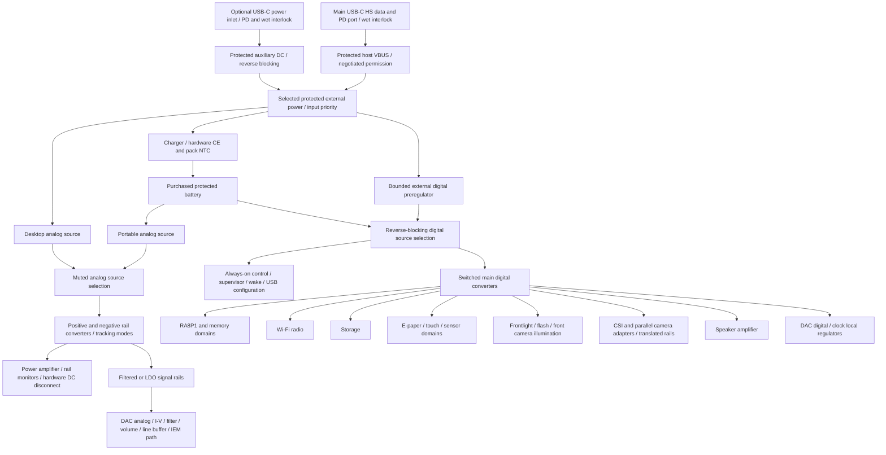

# Stage 5: portable and USB-PD desktop power architecture

**2026-10-05 external-review update:** the higher-output input-power assumptions is
reopened by [the disposition record](audio_external_review_2026-10-05.md).
RA8P1 remains system master. The sixteen-BUF634A bank is a research
comparator; no high-power implementation is selected. PCM768/DSD512, premium Bluetooth and the higher desktop envelope are
now owner-required. XU316 is the primary high-rate bridge candidate;
its exact package and routing are not selected.
Earlier recommendations below remain traceable study history, not a design
freeze. Use the revised work plan for the next implementation steps.

2026-10-04. Architecture study, not a selected charger circuit or a power
rating. This record expands [Stage 1](audio_stage1_requirements.md) and
reopens the historical power/audio assumptions in `system_power_design.md`.
Hardware is the task scope; own-server streaming does not require commercial
service DRM hardware. All device functions remain in the integration budget.

2026-10-05 charger review: the unplaced native BQ25798RQMR candidate is
Active and offered in quantity-one cut tape at $5.90, but remains HOLD.
[The detailed review](charger_pd_bq25798.md) establishes that SDRV cannot
provide sustained battery isolation with an attached adapter and that CE
only stops charging. P1 requires an independently qualified reverse-blocking
battery branch and bounded external digital preregulator/source mux; the
charger's NVDC output alone cannot establish desktop isolation. Reset charge
voltage, NTC configuration and normally inhibited CE remain acceptance gates.

## Decision boundaries

Desktop power must come from a negotiated external source, not unnoticed
battery supplementation. The high-power analog supply should be fed directly
from protected external power through its converters. The digital subsystem
may use a charger system output only if its mode contract prevents repeated
battery cycling. Battery presence must not be necessary for externally
powered desktop operation when the external source can support the load.

The existing Jauch protected 1S 6Ah pack is a **retained electrical candidate**,
not a final runtime-qualified choice. Existing BQ25616 charging calculations
are valuable historical work but do not approve a PD charger or expanded
desktop system. Do not apply 15/20V to existing SYS_AON or U13: the
[TPS63806](https://www.ti.com/product/TPS63806) input range ends at 5.5V.
Its control reservoir, source supervision and reverse-feed isolation must
remain on a deliberately bounded low-voltage bus. A new 2S pack would also
require a preregulator and a new cutoff/hold-up proof.

## Three power-path alternatives

| Alternative | Portable source | Desktop source and battery behavior | Benefit / limitation |
| --- | --- | --- | --- |
| P1: 1S retained pack, external analog bypass | Protected 1S pack to low-voltage digital bus and dedicated audio converters | Protected PD to analog converters directly and bounded digital preregulator; independent reverse-blocking battery/source mux, distinct controlled charge branch | Least disruption to current battery/hold-up design; high 1S converter input currents and inductor losses; charger defaults and true desktop isolation still need proof. Primary candidate for study integration. |
| P2: protected 2S pack and PD buck-boost charger | Purchased protected/balanced 2S pack, buck digital preregulator, audio converters | Same external analog bypass; digital output/battery mux or proved charger mode | Roughly halves battery input current at the same power; higher converter efficiency can help. New pack/harness/BMS, charge voltage, supervision and cutoff design; do not make a 2S pack by modifying the purchased 1S pouch. |
| P3: single NVDC output powers everything | 1S or 2S charger SYS supplies digital and all audio rails | PD through charger into SYS, battery supplements when demand exceeds input | Fewer supply branches, but charger SYS and BATFET must carry full desktop power, and default supplementation fails the desired battery-independent desktop behavior. Not preferred unless a complete mode/thermal proof resolves this. |

A charger label saying "power path" does not establish battery isolation.
[BQ25798 Rev C](https://www.ti.com/lit/ds/symlink/bq25798.pdf) explicitly
supports NVDC battery supplementation. It accepts 3.6–24V input and 1–4 cells,
with 750kHz/1.5MHz conversion and a 4x4mm QFN package. The 5A charging headline
is not a 5A USB entitlement or a guarantee of full system throughput.
Cell count is resistor-defined at PROG; other boot/reset charge settings,
watchdog behavior and TS limits must be checked against the exact pack.
Hardware CE must remain inhibited until the autonomous configuration is valid.

The [TI TIDA-050047 reference](https://www.ti.com/lit/ug/tiduey1/tiduey1.pdf)
demonstrates TPS25751D/BQ25798 integration and EEPROM configuration, primarily
for 2–4-cell batteries. Its existence does not qualify the 1S pack, wet-port
behavior or this design's lower termination voltage. TI's
[manufacturer support answer](https://e2e.ti.com/support/power-management-group/power-management/f/power-management-forum/1486218/usb-pd-chg-evm-01-usb-pd-chg-evm-01-battery-charger-register-values)
states that TPS25751 does not configure charger NTC register 18h. Accordingly,
"autonomous charger integration" must not be treated as an arbitrary register
initialization engine. Invalid/reset settings must never enable unsafe charge.

## USB connection and power roles

The owner explicitly requires **one-cable host-powered USB DAC operation**.
The primary port combines USB2 HS device data and a Type-C/PD sink power role
while connected to a computer. Power-role negotiation must not unnecessarily
change the USB data role. Playback draws from the host's authorized power;
surplus may charge the battery. Full battery means charge off, with a defined
restart hysteresis/maintenance policy rather than continuous cycling.

The allocation is evaluated at the protected input bus:
`P_charge_input <= max(0, P_authorized - P_playback_input - P_reserve)`.
Charge current is also bounded by pack temperature/current, charger and
conversion limits. A full or charge-inhibited battery sets this allocation
to zero while external power continues to run the device. Reserve covers
transients and source/cable/converter uncertainty; it is not additional USB
permission. Reduce charging first when the load rises, then reduce amplifier
capability before overloading the host. Do not assume average music power
proves a continuous rating. Verify fast load steps with charge active and
inactive, and net battery current during full-battery playback.

2026-10-05 clarification: this policy applies to the same host cable carrying
USB audio. Portable mode has a separate battery current/thermal envelope;
demanding headphones shorten runtime. No arbitrary host is promised maximum
headphone output plus charging. Stage 7 now investigates sixteen separate
unity composite loops plus four provisional upstream gain cores. Its 5.992W
high-rail idle screen and revised +/-12V 32-ohm swing supersede the earlier
common-controller and ideal Stage 5 power estimates for this candidate;
see [selection](audio_architecture_selection.md) and
`scripts/check_audio_power_study.py`.

The performance ceiling follows the actual source offer. Neither USB-C nor
USB DAC operation guarantees a 15/20V PD source. Start within applicable USB
permission, evaluate the Type-C current advertisement/PD contract, then enable
higher amplifier rails only when that contract and thermal budget support it.
Examples of source-side budgets, before conversion: 5V/0.5A=2.5W,
5V/0.9A=4.5W, 5V/1.5A=7.5W, 5V/3A=15W, 9V/3A=27W,
15V/3A=45W and 20V/3A=60W. These are arithmetic examples, not entitlements;
default/enumeration/suspend/PD and cable rules determine permitted current.

An **optional auxiliary PD inlet** is the fallback for computers with weak
power output: computer cable supplies audio and a separate adapter supplies
power. Its second wet detector/sealing and reverse-blocking costs are real.
Alternatively a compatible powered USB-PD dock/hub can provide data and
power through the single main port. Do not make either a prerequisite for
ordinary one-cable USB DAC use. An external charger without a USB host does
not supply audio data. No assumption that every computer can run maximum
desktop output plus charging is acceptable.

Two inputs must use reverse-blocking source selection with priority and
current limits; never join their VBUS nets. A power-only port cannot become
an uncontrolled OTG output. Source role on the data port needs its own
regulated 5V path, wet permission, short protection and battery/load budget.
Charger D+/D- detection must not electrically contend with RA8P1 USB-HS data.

[TPS25751](https://www.ti.com/product/TPS25751) remains the pre-existing
USB-005 PD/wet-port candidate, rather than a newly invented choice. Its D
variant integrates a high-voltage sink path and 5V source path, but is not a
USB audio controller. A simpler sink-only
[TPS25730](https://www.ti.com/product/TPS25730) reduces configuration work
for the power inlet; an independent wet detector/interlock would still be
needed, so lower controller complexity does not automatically reduce system
complexity. Exact orderable packages and controller count follow selection.

### Wet detection remains a qualification gate

The current [TPS25751 TRM Rev B](https://www.ti.com/lit/pdf/SLVUCR8), August
2026, moves liquid configuration to section 3.2.37, register 0x98. Detection
and corrosion mitigation both default disabled. The latter disconnects and
disables the port and pulls down CC; sampling and thresholds are configurable.
Enable both in a verified bundle. The external SBU sensing/protection network
and dry-before-first-power ordering remain unresolved, including depleted
battery insertion, absent/corrupt EEPROM, resets and wet attached operation.

Keep local sink/source switches normally off until valid dry permission.
Preserve the independent shutdown contract in `usb_interface.md`; application
firmware cannot be the sole wet-power barrier. Opening internal switches
does not de-energize an external source at the receptacle. Protection must
survive energized wet VBUS and cross-pin shorts. SBU sensing cannot prove
every contact is dry or confer an ingress-protection rating.

## Preliminary complete power tree

Connections describe functions, not a schematic. DIG battery isolation in
desktop mode requires an actual qualified reverse-blocking mux; BQ25798
CE/SDRV do not establish sustained attached-host isolation. The charge branch
must also be qualified against sensing and backfeed. The diagram does not
imply that two outputs may be wired together.
No missing regulator is approved solely by a name in this tree.

| Domain | Preliminary treatment | Required closure |
| --- | --- | --- |
| Always-on, supervisor, USB controller/configuration | Low-Iq bounded low-voltage converter, independent of main host | Dry boot, weak input, corrupt configuration, cutoff/hold-up timing, suspend/leakage and no backfeed. |
| CPU, RAM, flash/SD, camera digital | Efficient switched converters with local bypass; separate enable domains where useful | Existing voltage/pinmux/peak allocations, startup, camera adapter limits, storage inrush and measured average playback load. |
| Wi-Fi/radio | Separate filtered power branch on common ground | Transmit current peaks, transport bottleneck, RF demodulation in audio, time-varying battery demand. |
| E-paper, touch, sensors, frontlights, flash, speakers | Existing functional rails/boost stages with budgeted shutdown | Screen refresh and lighting/camera/speaker concurrent cases; do not label their worst case as idle music consumption. |
| DAC digital and clocks | Efficient preregulation then local low-noise regulation where justified | Device-specific noise/PSRR, clock sidebands, headroom, sequencing and reverse currents. |
| DAC analog, I/V, filter, line, IEM | Dedicated low-current filtered/LDO rails | Exact voltage, current, LDO noise gain, capacitive stability, differential common-mode and pop/DC behavior. |
| Power headphone stage | Switch-mode dual rails with local LC/filtering; LDO optional only if current/loss allows | Full sine/burst current, bias, SOA, output-stage PSRR at switching frequency, intermodulation, dropout and enclosure heat. |

## Dual rails and continuous power budget

Calculate both stereo channels driven. With differential output V, each BTL
leg swings V*sqrt(2)/2 peak but carries the **full** headphone current. Use
the explicit envelope `min(16Vrms, Ipeak*R/sqrt(2), sqrt(4W*R))`, with
Ipeak <=0.7071A per channel. These are investigation caps, not guaranteed ratings.
Rails use two ranges: +/-10V for low loads and +/-14V for larger swing, with
an assumed 1.5V leg headroom. Exact devices may require more at hot load.

The ideal Class-B screen excludes amplifier quiescent current, crossover,
current-sharing losses and real converter behavior. The 90% efficiency, 3W
other-device allowance, 4.55W battery charging and 10% input margin below
are explicit assumptions. They are not replacement worst-case allocations
for the existing whole-device budget. Script: `check_audio_power_study.py`.

| Load ohms | Differential Vrms | W/ch | Rails | Amp DC W | Average A per rail, stereo | Device heat W before charge | Source W including assumed charge/margin |
| --- | ---: | ---: | --- | ---: | ---: | ---: | ---: |
| 16 | 8.000 | 4.000 | +/-10 | 18.006 | 0.900 | 15.007 | 30.869 |
| 32 | 11.314 | 4.000 | +/-10 | 12.732 | 0.637 | 9.147 | 24.423 |
| 50 | 14.142 | 4.000 | +/-14 | 14.260 | 0.509 | 10.845 | 26.290 |
| 80 | 16.000 | 3.200 | +/-14 | 10.084 | 0.360 | 7.804 | 21.185 |
| 150 | 16.000 | 1.707 | +/-14 | 5.378 | 0.192 | 5.562 | 15.434 |
| 300 | 16.000 | 0.853 | +/-14 | 2.689 | 0.096 | 4.281 | 12.148 |
| 600 | 16.000 | 0.427 | +/-14 | 1.344 | 0.048 | 3.641 | 10.504 |

Numerical outputs govern rounded table values. At 16 ohms the two channels
can demand ~1.414A instantaneous per rail before bias; an initial rail design
allowance of at least 1.5A transient needs capacitor/control-loop proof.
This does not authorize 4W into sub-16-ohm IEMs. IEM mode imposes a much
lower voltage/current ceiling.

Investigate a **45W-class source** with a usable 15V/3A or 20V profile for
the full desktop envelope, selected after complete concurrent-load budgeting.
A 30W adapter may suffice for many headphone loads with charging reduced,
but does not close the 16-ohm screen with margin. An adapter's total wattage
does not guarantee the required per-port PDO. Respect contract/cable current,
voltage drops, allowed tolerance, thermal derating and transient reserve.

Lower power or missing PD must force lower rails and output ceiling before
clipping/UVLO, preferably using hardware rail-good and current interlocks.
Charging is the first discretionary load to shed. After loss of external
power, mute/disconnect before transferring to portable rails; never silently
draw desktop peak power from the battery to preserve a marketing rating.

### Host power and charging state contract

| State | Source and amplifier behavior | Battery/charging behavior |
| --- | --- | --- |
| USB connected, permission/contract not yet valid | USB data attach and low-power startup only; high rails disabled | Charger CE inhibited or limited to independently qualified startup allowance. |
| Adequate host PD, battery below charge threshold | Host supplies digital and analog loads within negotiated limits | Charge only from remaining power, bounded by pack current/temperature/termination; reduce charge before output capability. |
| Adequate host PD, battery full | Continue host-powered playback, including qualified desktop output | Stop charging; preserve battery isolation/zero net cycling. Full detection and restart hysteresis require hardware/charger proof. |
| Weak host or lower contract | Lower rails/gain/output ceiling; continue USB audio if system budget permits | Charge reduced/off; no desktop battery supplementation by default. An explicit hybrid mode, if later implemented, must report net battery discharge and cannot advertise host-only continuous output. |
| Host disconnect, suspend or contract loss | Mute/disconnect before supply/rail transition; respect suspended host limits | Battery portable mode, separate thermal/current/output ceiling; no high-power permission retained from an expired contract. |
| Battery portable high-load listening | Energy use rises with output and converter loss; output remains pack/SOA/thermal-limited | Runtime explicitly shorter than normal-listening target. Full desktop rating is not implied on battery. |
| Wet port, battery/NTC/rail fault | Hardware permission removed, outputs safely disconnected as appropriate | Charge/source off independently of application software; connector-side voltage may remain present from the host. |

Charge termination alone is not proof of desktop isolation. Measure net pack
current during full-battery playback and load transients. A charger may restart
after battery voltage falls; define the intended hysteresis/maintenance policy
and ensure system demand does not cause repeated discharge/recharge cycles.
An adapter budget must cover the complete device, not only headphone watts.

### Converter and LDO alternatives

[LM5155](https://www.ti.com/product/LM5155) is an external-switch boost/
SEPIC/flyback controller candidate, allowing current capability to be designed
around MOSFET/inductor/transformer limits. A dual-output flyback saves parts
but load cross-regulation and leakage spikes need analysis; separate regulated
rails provide more predictable load behavior at the cost of area.

[LT8582](https://www.analog.com/media/en/technical-documentation/data-sheets/8582f.pdf)
provides independent boost/SEPIC/inverting channels, illustrating a compact
dual-rail alternative. Its 3A specification concerns switch current, not
negative output current. It cannot be approved by comparing that headline to
0.9A output; duty cycle, combined inductor currents, ripple, diode losses,
Vin, hot limits and voltage stress must be calculated. Feeding 1S and PD into
one fixed boost configuration is not automatically valid when input exceeds
the desired positive output. A preregulated analog bus or topology that can
both buck and boost is required. This converter is an alternative, not selected.

[LT3045 Rev D](https://www.analog.com/media/en/technical-documentation/data-sheets/lt3045.pdf)
and [LT3094 Rev B](https://www.analog.com/media/en/technical-documentation/data-sheets/lt3094.pdf)
are positive/negative 500mA low-noise LDO candidates for signal stages.
One of each cannot supply the 0.900A average desktop rail case. Parallel
devices, sharing and thermal layout add cost and area. Just 0.6V dropped on
both 0.900A rails adds 1.080W. Avoid regulating power-amplifier rails this way
unless measured PSRR/noise benefits justify the loss and dropout margin.

Do not extrapolate low-frequency PSRR to converter switching frequency.
Assess ripple spectrum and PSRR at the actual load/headroom, supply-induced
IMD, RF pickup, beat frequencies and PFM/burst-mode tones. Use synchronized
conversion only if it improves measured spectrum; synchronization itself
does not make a converter quiet. Check reverse current during sequencing.

## Battery energy, portable budgets and packaging

The existing [Jauch August 2024 pack specification](https://www.jauch.com/downloadfile/677e3f68c583d30f0e3fd6874fe248710/matd_246525_lp906090jh.pdf)
defines 3.7V nominal, 6Ah minimum at its test condition, 6A maximum discharge,
3A maximum charge and no pack thermistor. Keep the insulated cell-contact
NTC and hardware open/short charge inhibition. Lot/revision, connector,
harness and actual cutoff/load remain qualification conditions. Its 22.2Wh
nameplate does not guarantee usable energy at 4.10V termination.

An **80% usable-energy assumption** gives 17.76Wh. Proposed whole-device
targets are 1.65W average for local playback (~10.76h) and 2.00W own-server
streaming (~8.88h), IEM/normal listening, frontlights/cameras/speakers off.
These are aggressive allocation targets to validate, not claims. If measured
load is instead 2.2/2.7W, runtime becomes ~8.07/6.58h. Additional pack energy
or deeper digital power gating would then be necessary; do not hide a miss.

Budget conversion, processor/memory, radio, storage, display idle, sensors,
DAC/clock, signal stages, IEM stage and output music power independently.
Use hardware sleep/shutdown pins and switched domains where startup remains
safe. Full-speed processor and camera worst cases cannot represent average
playback. Existing 2.095A main-rail allocation remains a peak planning screen
and is already incompatible with treating the earlier 4A battery allocation
as fully closed. Consolidate both screens before selecting power components.

For comparison, delivering a 6W portable analog bus at 90% assumed efficiency
requires 2.083A from 3.2V 1S, or 1.042A from 6.4V 2S, before other loads.
P2 therefore has a credible efficiency/current advantage, but is justified
only if a purchasable protected pack and complete new supervision design fit.
No cell, BMS or charger current rating is inferred from this simple quotient.

## Heat, grounding and closure gates

The 16-ohm case already creates ~15W device heat before charging/bias under
the assumptions above. With a hypothetical 15K enclosure rise allocation,
that needs ~1K/W effective case-to-ambient performance. A compact sealed
e-reader cannot claim this from copper pours or IC theta-JA. A thermal spreader
and possibly a desktop dock heat path are architectural requirements if the
4W rating is retained. If enclosure validation fails, publish a lower sustained
limit and a separately timed burst limit. Charge/playback needs a separate
pack-temperature and hot-surface test; never solve it by raising pack limits.

Use a continuous ground reference with deliberate current-return placement.
Keep converter switching loops/inductors and radio antennas away from input,
DAC references and clock nets. Keep headphone return and rail charging
currents out of small-signal reference paths. Conceptually investigate 6–8
layers with uninterrupted reference planes, controlled USB/CSI impedance,
local thermal copper/vias and shielding as justified. No footprint/PCB work
is authorized by this study. Do not split ground under signals crossing domains.

Before component/CAD release: prove startup/defaults, contract-wide current
limits, both-port reverse blocking, wet/dead-battery ordering, desktop battery
isolation, low-voltage reservoir compatibility, fault-latched output disconnect,
rail-current/SOA/headroom and intermediate-amplitude worst heat. Then verify
noise under USB, PD, charging and RF activity, and sustained dual-channel
thermal behavior at 25/35C ambient. Until these close, the power tree remains
an engineering direction rather than an electrically qualified subsystem.
